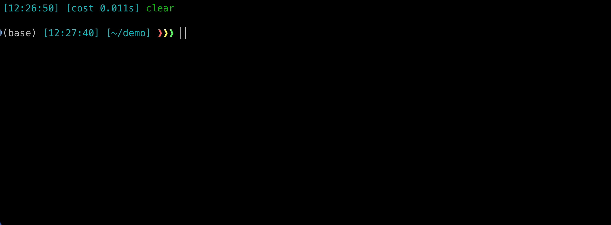
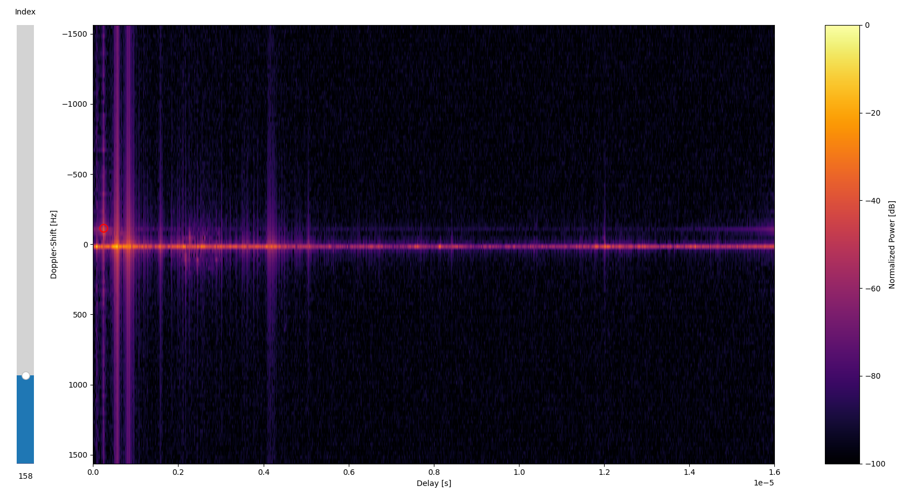

[](https://zenodo.org/badge/latestdoi/686893926)

# ISAC UAV Dataset

A full, interactive documentation for the dataset is available [here](https://ems-tu-ilmenau.github.io/isac-uav-dataset-docs/)!

## Introduction

Contains scripts and code demo to work with the ISAC UAV Dataset from the EMS Group at TU Ilmenau.
Please note that due to large filesizes of the dataset, this repository does not contain the actual dataset.
Instead, the files are downloaded by the code in this repository. 
Below, we outline the download process and provide a simple demo for the dataset. 

**NOTE** that the dataset is encrypted and requires a password to be decrypted. 
Before downloading, you need to enter a password, then the files will be downloading, decrypted, and unzipped in the main folder automatically.
If the decryption fails due to an invalid password, please run the download script again. It will not perform a new download and use temporary files instead.

To get the password, drop us a short email with your name, affiliation, and a short explanation how you want to use the dataset:
- [steffen.schieler@tu-ilmenau.de](mailto:steffen.schieler@tu-ilmenau.de?subject=[ISAV-UAV-Dataset]) 
- [reza.faramarzahangari@tu-ilmenau.de](mailto:reza.faramarzahangari@tu-ilmenau.de?subject=[ISAV-UAV-Dataset])


## Downloading the dataset

As explained above, the Git repository does not contain the actual dataset.
Storing large binary-like files in a Git Repository is not recommended, we download the dataset files into the repository with a download script.

Hence, to obtain the dataset, you must
1. Clone this repository
2. Run the download script using the `downloader.py`

### Step 1: Clone this repository
Clone this repository using the following command:
```
git clone https://github.com/EMS-TU-Ilmenau/isac-uav-dataset.git
```



### Step 2: Download
The `downloader.py` takes care of the download, decryption, unpacking, and verification of files.
Shasum hashes for the files in the `scenarions.shasums` also provide a way to track changes of the provided dataset files for the users (via the history of `scenarions.shasums`).

To download all available files, simply run the `downloader.py` script without any arguments:
```
python downloader.py
```
which will bring you into default mode.
In this case, all scenarios will be downloaded.
**Caution** This can take up a large amount of space on your hard drive.


Alternatively, you can also specify scenarios with:  
```
python downloader.py --scenario SCENARIO_1 SCENARIO_2 ... SCENARIO_N
```
Pass the desired scenarios separated by spaces, e.g.,
```
python downloader.py --scenario 1to2_H15_V11 2to3_H15_V11
```

To see all available options run:
```
python downloader.py --help
```

## How to use the dataset
We provide two examples how to work with the dataset in the `snippets` folder.
- `snippets/plot_receiver.py` demonstrates how to use the `Dataset`-class to plot a Delay-Doppler Map with the groundtruth of the UAV position for a single receiver.
- `snippets/plot_scenario.py` demonstrates how to use the `Dataset`-class to plot a Delay-Doppler Map with the groundtruth of the UAV position all three receivers.
- `snippets/load_example.py` demonstrates how to load the dataset from the `*.h5` files into Python. It provides a `Dataset`-class that can also be used in other scripts.
- `snippets/torch_dataset.py` demonstrates how to use the `Dataset`-class to create a PyTorch `Dataset` for training a neural network.


### Example 1: Plotting Delay-Doppler Map with UAV Groundtruth (Delay-Doppler Maps)
A simple demonstration of the dataset is to plot the Delay-Doppler Map for a single or multiple receivers. 
Such an example can be found in `snippets/plot_receiver.py` and `snippets/plot_scenario.py`.

Here is an example for the `plot_receiver.py` script (creates 1 interactive plot):

```python
python plot_receiver.py --channel-file 1to2_H15_V11_VGH0_channel.h5 --target-file 1to2_H15_V11_VGH0_target.h5
```

The result is an interactive plot with a slider on the left side. 
A red circle marks the UAV (computed from the RTK groundtruth).  


Here is an example for the `plot_scenario.py` script (creates 3 interactive plots):

```python
python plot_scenario.py --scenario 1to2_H15_V11
```

**Note** that by default, the `plot_scenario.py` also applies a Pulse-Pair Processing step (window length of 1) to subtract static clutter.


### Example 2: Working with `*.h5`
The provided `UAVDataset`-class can be used to load the dataset from the `*.h5` files into Python.
```python
channel_file = "1to2_H15_V11_VGH0_channel.h5"
target_file = "1to2_H15_V11_VGH0_target.h5"

dataset = UAVDataset(channel_file, target_file)
print(dataset)
```

Available properties are:
- `dataset.channel`: The channel dataset as a `numpy.ndarray` of shape `(n_snapshots, n_freq)`.
- `dataset.groundtruth`: The target groundtruth (delay, Doppler) as a `numpy.ndarray` of shape `(n_snapshots, 2)`.
- `dataset.tx`: Position of the Tx antenna (`numpy.ndarray`) with shape `(1, 3)`.
- `dataset.rx`: Position of the Rx antenna (`numpy.ndarray`) with shape `(1, 3)`.
- `dataset.uav`: Position of the UAV (`numpy.ndarray`) with shape `(n_snapshots, 3)`.

Check the implementation of the class in `snippets/load_example.py` to learn more about the available properties.

### Example 3: Creating a PyTorch `Dataset`
The provided `UAVDataset`-class can be used to create a PyTorch `Dataset` for training a neural network.
```python
class TorchDataset(Dataset):
    def __init__(self, dataset: UAVDataset, t_window: int = 100, return_uavpos: bool = False):
        self.dataset = dataset
        self.t_window = t_window
        self.return_uavpos = return_uavpos
        
        if return_uavpos and self.dataset.uav is None:
            raise ValueError("UAV Positions not loaded!")
        
        return
    
    def __getitem__(self, idx: int) -> [torch.Tensor, torch.Tensor]:
        if self.return_uavpos:
            return (
                torch.from_numpy(self.dataset.channel[idx: idx + self.t_window]), 
                torch.from_numpy(self.dataset.groundtruth[idx + self.t_window // 2]),
                torch.from_numpy(self.dataset.uav[idx + self.t_window // 2])
            )
        else:
            return (
                torch.from_numpy(self.dataset.channel[idx: idx + self.t_window]), 
                torch.from_numpy(self.dataset.groundtruth[idx + self.t_window // 2]),
            )
    
    def __len__(self) -> int:
        return len(self.dataset)- self.t_window//2
    
    def __str__(self) -> str:
        return str(self.dataset)
```

To create a `DataLoader` with complex baseband and delay-doppler groundtruth, e.g., use:
```python
dataset = UAVDataset(channel_file)
dataloader = DataLoader(
  TorchDataset(dataset), 
  batch_size=16, 
  shuffle=True,
)
```

To create a `DataLoader` with complex baseband, delay-doppler groundtruth, and UAV positions, e.g., use:
```python
dataset = UAVDataset(channel_file, target_file)
dataloader = DataLoader(
  TorchDataset(dataset, return_uavpos=True), 
  batch_size=16, 
  shuffle=True,
)
```

Check the provided file `snippets/torch_dataset.py` to learn more about the available options.

## License
This dataset (and all remote files associated with it) is licensed under the [Creative Commons Attribution-NonCommercial-NoDerivatives 4.0 International](https://creativecommons.org/licenses/by-nc-nd/4.0/legalcode) License.

To use this dataset and/or scripts or any modified part of them, cite:
```tex
@INPROCEEDINGS{10133118,
  author={Beuster, Julia and Andrich, Carsten and Döbereiner, Michael and Schieler, Steffen and Engelhardt, Maximilian and Schneider, Christian and Thomä, Reiner},
  booktitle={2023 17th European Conference on Antennas and Propagation (EuCAP)}, 
  title={Measurement Testbed for Radar and Emitter Localization of UAV at 3.75 GHz}, 
  year={2023},
  pages={1-5},
  doi={10.23919/EuCAP57121.2023.10133118}
}
```

The paper is available on [IEEEXplore](https://ieeexplore.ieee.org/document/10133118) and [Arxiv](https://arxiv.org/abs/2210.07168).
Please make sure to cite the IEEEXplore paper if you use the dataset for your publication.
